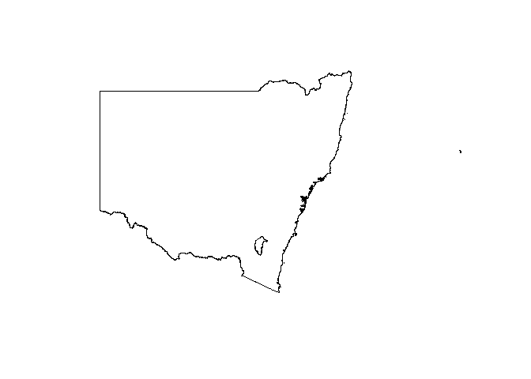

<!-- README.md is generated from README.Rmd. Please edit that file -->

# ASGSmaps

<!-- badges: start -->

[](https://lifecycle.r-lib.org/articles/stages.html#experimental)
<!-- badges: end -->

ASGSmaps is an API wrapper for the [Australian Statistical Geography
Standard (ASGS) Edition
3](https://www.abs.gov.au/statistics/standards/australian-statistical-geography-standard-asgs-edition-3/jul2021-jun2026)
from the [Australian Bureau of Statistics
(ABS)](https://www.abs.gov.au/). It includes functions to access
information about statistical geography standards and to download the
data from the [ABS
API](https://www.abs.gov.au/statistics/standards/australian-statistical-geography-standard-asgs-edition-3/jul2021-jun2026/access-and-downloads/data-services-and-apis).

## Installation

You can install the development version of ASGSmaps like so:

``` r
# # install remotes package
# install.packages('remotes')
# # install ASGSmaps from github
# remotes::install_github('mrenkin/ASGSmaps')
```

## Example

Get information about ASGS services and standards and use the information to build a query.

``` r
library(ASGSmaps)

# get a list of ASGS services available
available_services()
#>  [1] "2021"          "AMLPS2017"     "ASGC2001"      "ASGC2004"     
#>  [5] "ASGC2006"      "ASGC2007"      "ASGC2011"      "ASGS2011"     
#>  [9] "ASGS2012"      "ASGS2013"      "ASGS2014"      "ASGS2015"     
#> [13] "ASGS2016"      "ASGS2017"      "ASGS2018"      "ASGS2019"     
#> [17] "ASGS2020"      "ASGS2021"      "ASGS2022"      "ASGS2023"     
#> [21] "Commuting2016" "Hosted"        "PSMA2011"      "SEIFA2016"    
#> [25] "Utilities"

# get a list of standards available within a service
available_standards('ASGS2021')
#>  [1] "ADD (FeatureServer)"   "ADD"                   "AUS (FeatureServer)"  
#>  [4] "AUS"                   "CED (FeatureServer)"   "CED"                  
#>  [7] "DZN (FeatureServer)"   "DZN"                   "GCCSA (FeatureServer)"
#> [10] "GCCSA"                 "IARE (FeatureServer)"  "IARE"                 
#> [13] "ILOC (FeatureServer)"  "ILOC"                  "IREG (FeatureServer)" 
#> [16] "IREG"                  "LGA (FeatureServer)"   "LGA"                  
#> [19] "MB (FeatureServer)"    "MB"                    "POA (FeatureServer)"  
#> [22] "POA"                   "RA (FeatureServer)"    "RA"                   
#> [25] "SA1 (FeatureServer)"   "SA1"                   "SA2 (FeatureServer)"  
#> [28] "SA2"                   "SA3 (FeatureServer)"   "SA3"                  
#> [31] "SA4 (FeatureServer)"   "SA4"                   "SAL (FeatureServer)"  
#> [34] "SAL"                   "SEARCH"                "SED (FeatureServer)"  
#> [37] "SED"                   "SOS (FeatureServer)"   "SOS"                  
#> [40] "SOSR (FeatureServer)"  "SOSR"                  "STE (FeatureServer)"  
#> [43] "STE"                   "SUA (FeatureServer)"   "SUA"                  
#> [46] "TR (FeatureServer)"    "TR"                    "UCL (FeatureServer)"  
#> [49] "UCL"

# get a description of an available standard
standard_description('ASGS2021', 'STE')
#> [1] "States and Territories consist of one or more Statistical Areas Level 4 (SA4).\nSix States and six Territories are recognised in the ASGS: New South Wales, Victoria, Queensland, South Australia, Western Australia, Tasmania, Northern Territory, Australian Capital Territory, Jervis Bay Territory, Territory of Christmas Island, Territory of the Cocos (Keeling) Islands, and Territory of Norfolk Island.\nFurther information about these regions can be found in the following publication: Australian Statistical Geography Standard (ASGS) Edition 3\nhttps://www.abs.gov.au/statistics/standards/australian-statistical-geography-standard-asgs-edition-3/jul2021-jun2026"

# get a list of fields available within a standard
standard_fields('ASGS2021', 'STE')
#>  [1] "field: objectid, type: esriFieldTypeOID, alias: OBJECTID"                                    
#>  [2] "field: shape, type: esriFieldTypeGeometry, alias: Shape"                                     
#>  [3] "field: STATE_CODE_2021, type: esriFieldTypeString, alias: STATE_CODE_2021, length: 1"        
#>  [4] "field: STATE_NAME_2021, type: esriFieldTypeString, alias: STATE_NAME_2021, length: 50"       
#>  [5] "field: CHANGE_FLAG_2021, type: esriFieldTypeString, alias: CHANGE_FLAG_2021, length: 1"      
#>  [6] "field: CHANGE_LABEL_2021, type: esriFieldTypeString, alias: CHANGE_LABEL_2021, length: 11"   
#>  [7] "field: AUS_CODE_2021, type: esriFieldTypeString, alias: AUS_CODE_2021, length: 3"            
#>  [8] "field: AUS_NAME_2021, type: esriFieldTypeString, alias: AUS_NAME_2021, length: 50"           
#>  [9] "field: AREA_ALBERS_SQKM, type: esriFieldTypeDouble, alias: AREA_ALBERS_SQKM"                 
#> [10] "field: ASGS_LOCI_URI_2021, type: esriFieldTypeString, alias: ASGS_LOCI_URI_2021, length: 622"
#> [11] "field: st_length(shape"                                                                      
#> [12] "field:, type: esriFieldTypeDouble, alias: Shape_Length"                                      
#> [13] "field: st_area(shape"                                                                        
#> [14] "field:, type: esriFieldTypeDouble, alias: Shape_Area"

# get a list of unique values from a field
field_values('ASGS2021', 'STE', 'STATE_NAME_2021')
#>                 state_name_2021
#> 1               New South Wales
#> 2                      Victoria
#> 3                    Queensland
#> 4               South Australia
#> 5             Western Australia
#> 6                      Tasmania
#> 7            Northern Territory
#> 8  Australian Capital Territory
#> 9             Other Territories
#> 10            Outside Australia

# use the information to build a query
map <- get_map_data(
  service = 'ASGS2021',
  standard = 'STE',
  where = "STATE_NAME_2021 IN ('New South Wales')"
)

plot(map$geometry)
```


